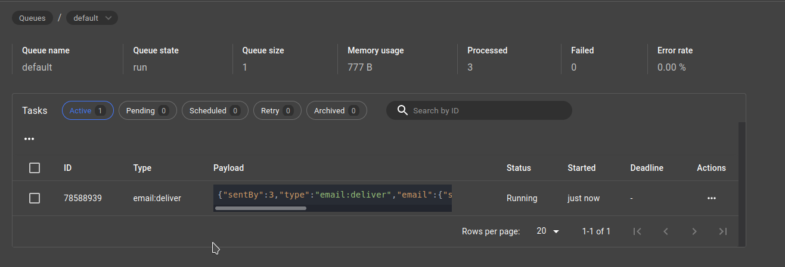

An example of [asynq](https://github.com/hibiken/asynq) producer and consumer that creates tasks to be sent to redis and process tasks from Redis queue.

# Requirement

Go version >= 1.14

## Protobuf 

To use protobuf, install protobuf compiler [https://grpc.io/docs/protoc-installation/](https://grpc.io/docs/protoc-installation/) and its Go library 

    go install google.golang.org/protobuf/cmd/protoc-gen-go
    go install google.golang.org/grpc/cmd/protoc-gen-go-grpc@latest

Add to `PATH`

    export PATH="$PATH:$(go env GOPATH)/bin"

# Run

We can build two kind of binaries from this same codebase, producer and consumer.

Multiple producers can be run by setting its port number to environment variable

    API_PORT=4001 go run cmd/producer/main.go
    API_PORT=4002 go run cmd/producer/main.go

Consumer can be run with

    go run cmd/consumer/main.go

May also set different `API_PORT` for multiple consumers.

    API_PORT=8001 go run cmd/consumer/main.go

# Gracefully Shutdown

Find the process ID of this API by port

    lsof -t -i:4001

Send SIGTERM signal

    kill -SIGTERM <pid number>

Or one-liner

    kill -SIGTERM $(lsof -t -i:4001)

# Usage

## Producer

Send a task by sending an http request to a Producer. In production, send the request to a load balancer that does reverse proxy between your producers.

    curl --location --request POST 'http://0.0.0.0:4001/api/v1/email' \
    --header 'Content-Type: application/json' \
    --data-raw '{
        "subject": "test subject",
        "content": "test content",
        "type": "referee",
        "sent_by": 3,
        "parameters": {
            "to": 2
        }
    }'

## Consumer

The consumer server(s) will automatically pick up the task from Redis.

# Monitor

Run `asynq stats` or [`asynqmon`](#asynqmon) [http://localhost:8080/](http://localhost:8080/) and you will see tasks being process, succeeded, or failed tasks.

Payload can be inspected in this asynqmon web UI if payload is serialized with JSON.

## asynqmon

Install

    git clone https://github.com/hibiken/asynqmon.git
    cd asynqmon
    make build

Ensure `/usr/local/bin` is in your path. Otherwise, add the following line to your `bashrc`

    sudo mv ./asynqmon /usr/local/bin
    source ~/.bashrc
    PATH=$PATH:/usr/local/bin

Run

    asynqmon

    
# Git hooks

Add git hooks by registering the path to `.git-hooks` folder

    git config core.hooksPath .git-hooks
